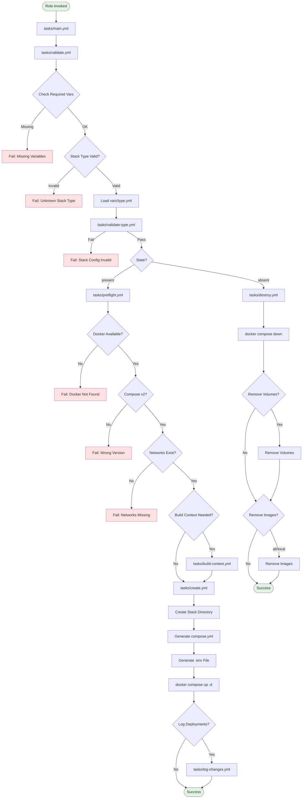
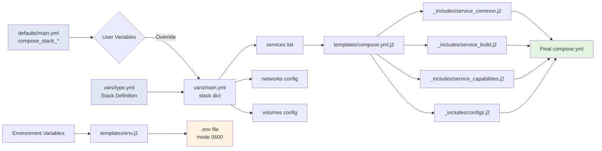
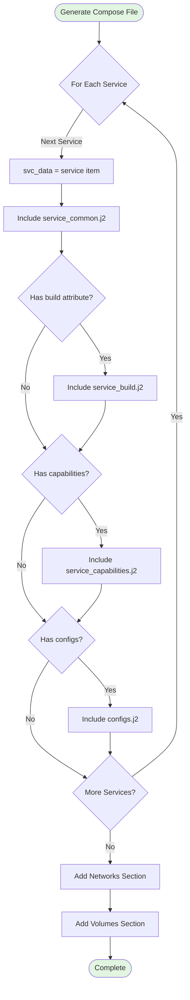
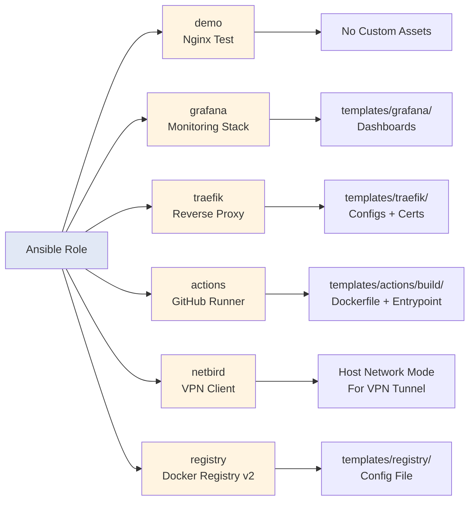
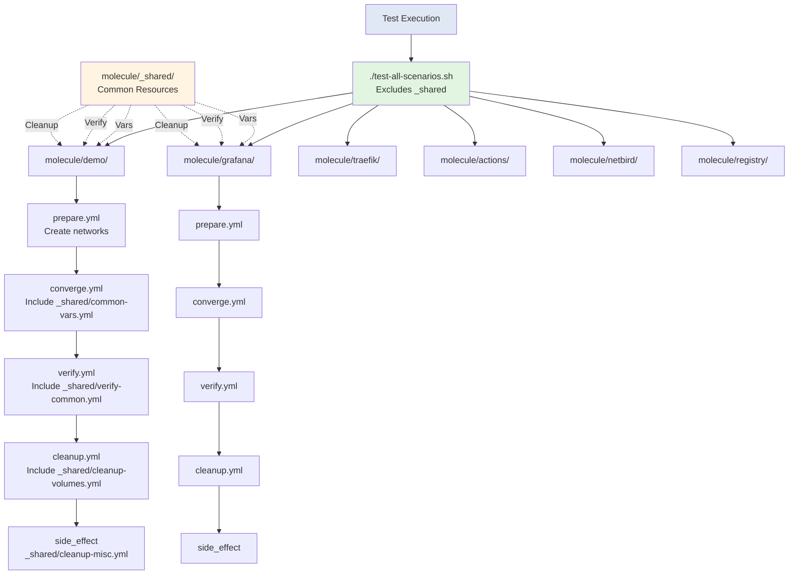

# Architecture Diagram

This diagram illustrates the complete workflow of the Ansible Docker Compose Stack Role.

## Configuration Flow

## Template Processing

## Stack Types

## Testing Structure

## Key Components

### Validation Chain
1. Generic variable validation (validate.yml)
2. Stack-specific config validation (validate-type.yml)
3. Environment preflight checks (preflight.yml)

### File Permissions
- Regular files: 0644
- Directories: 0755
- Environment files (.env): 0600

### Network Architecture
- Auto-generated network: `{{ stack.name }}`
- Additional networks: `stack.additional_networks` (must exist externally)
- Netbird uses `network_mode: host` for direct network access (required for VPN tunneling)

### Build Context
- Auto-detected via `build` attribute in service definition
- Files templated from `templates/{{ type }}/build/`
- Dockerfile and assets copied to stack directory

### Destroy Options
- `compose_stack_destroy_remove_volumes`: Remove volumes (boolean)
- `compose_stack_destroy_remove_images`: Remove images (all/local/false)
